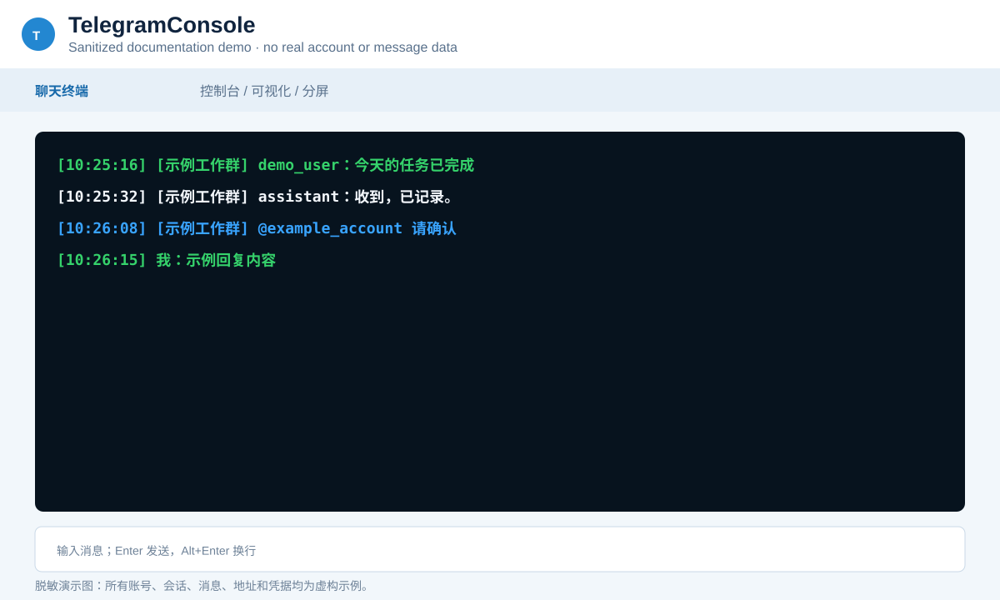
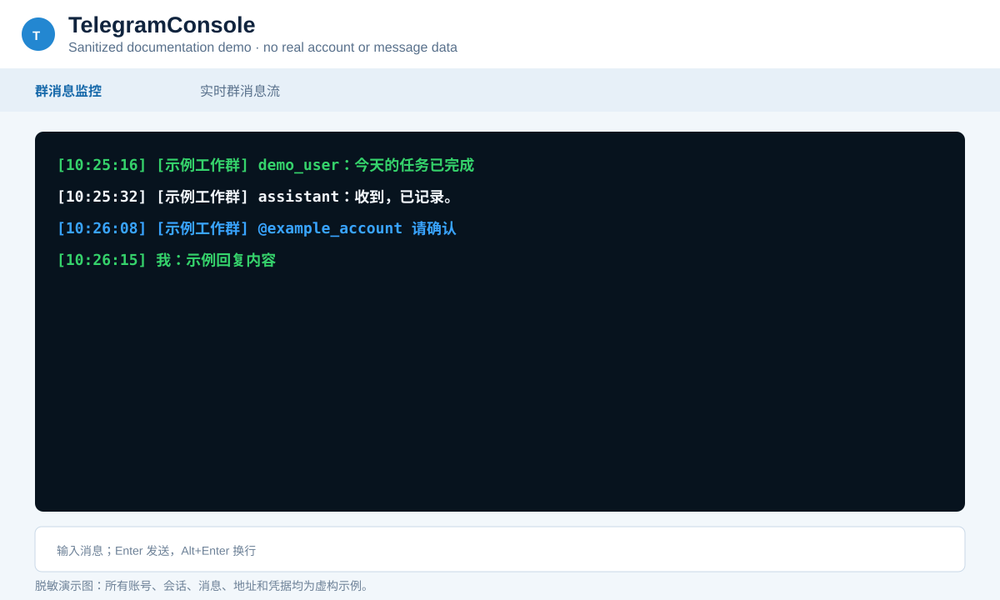
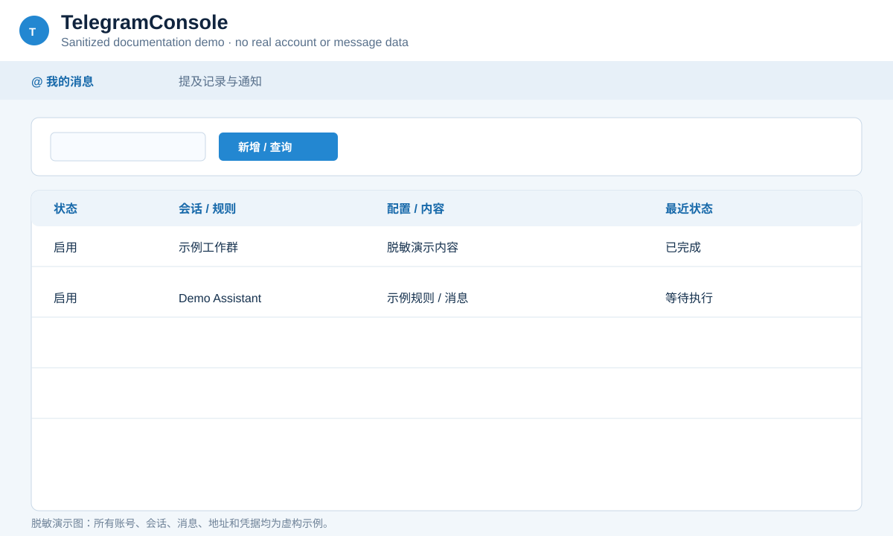
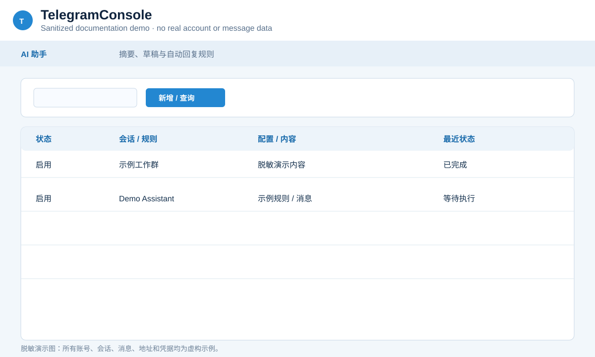
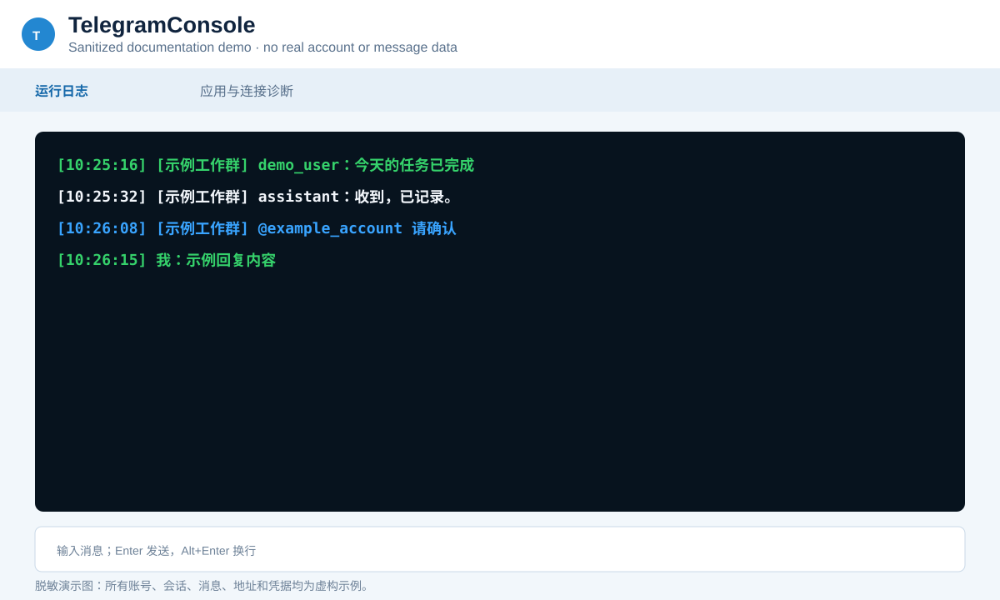
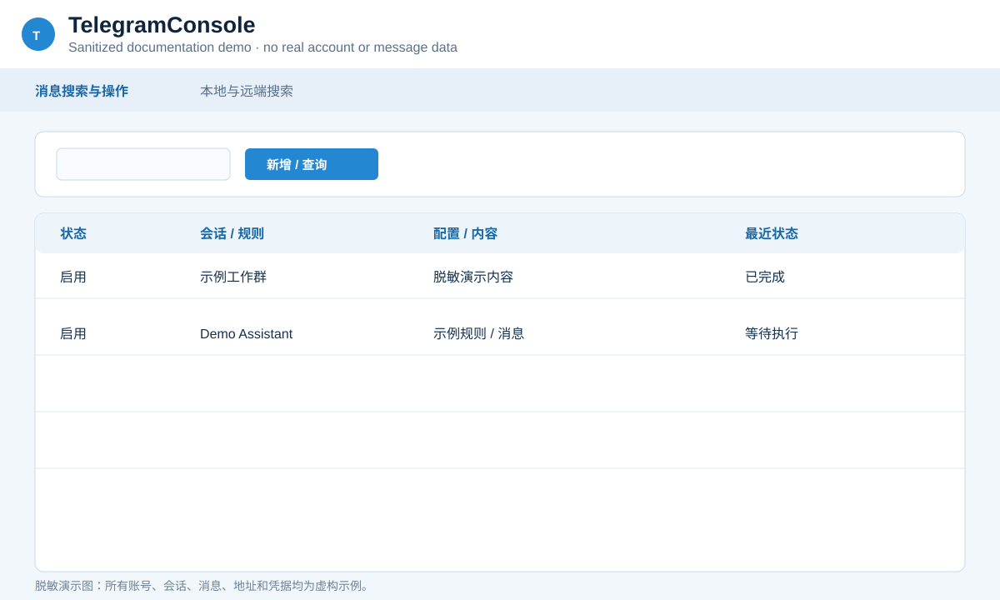
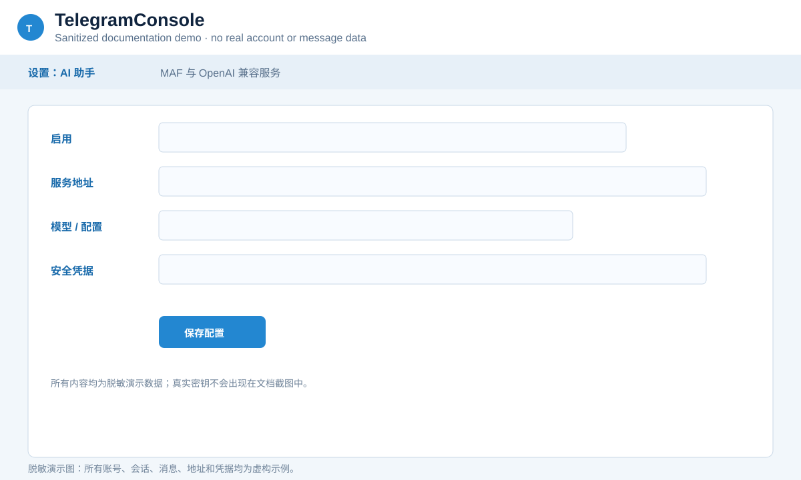
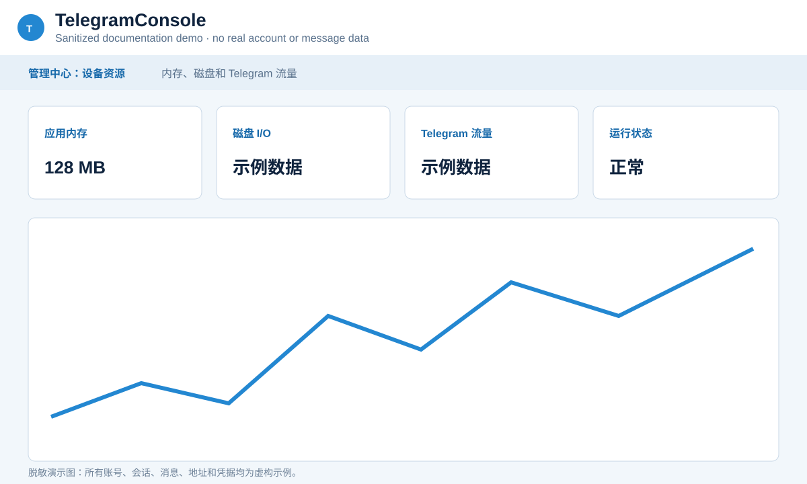
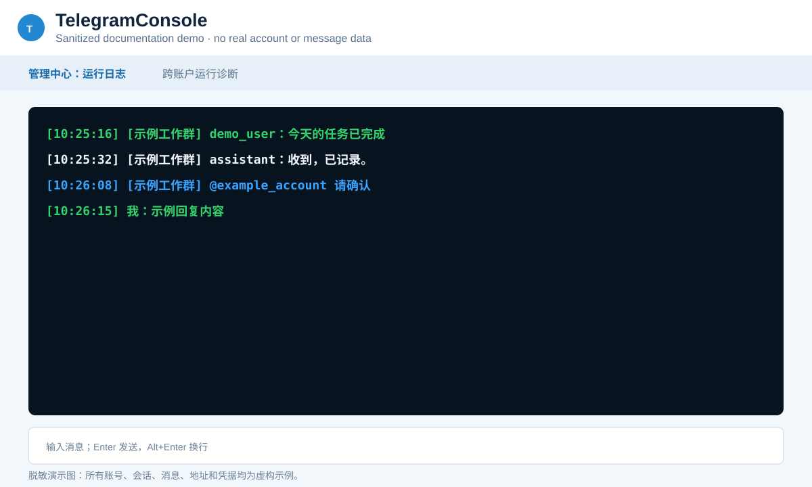

# 界面图集 / UI Gallery

[中文](SCREENSHOTS.md) | [English](#english)

> 以下均为脱敏演示界面图，用于说明各页签的用途和布局。账号、群名、消息、地址、邮箱、IP 和凭据均为虚构示例；仓库中不包含真实用户数据。

## 账号工作区

| 页签 | 说明 |
| --- | --- |
| 聊天终端 | 控制台、可视化和分屏消息视图，支持发送、引用、编辑和媒体链接。 |
| 群消息监控 | 实时显示已启用群聊的收发消息。 |
| 定时签到 | 配置每日/每周任务、完成通知与立即执行。 |
| 间隔分析 | 累计消息达到阈值后生成并发送简报。 |
| @ 我的消息 | 查看提及记录及 Telegram / 邮件通知状态。 |
| 异常中心 | 账号级异常查询、重发通知和手动登录提醒。 |
| 发件箱 | 可靠发送记录、未知结果确认和重试。 |
| AI 助手 | 会话摘要、回复草稿和可配置的群成员自动回复。 |
| 运行日志 | 查看账号运行和连接诊断日志。 |

## 效率工具

效率工具通过独立窗口提供消息搜索、服务器定时、自动化规则和草稿/文件夹管理。

## 全局设置

## 管理中心

管理中心统一显示跨账户配置和公共资源；每个聊天账号仍使用独立工作区。

---

## English

> These are sanitized documentation mock screenshots. Account names, chats, messages, addresses, email addresses, IPs, and credentials are fictional examples only. No real user data is included in this repository.

The gallery covers every current workspace tab, the four Productivity Tools tabs, the three global Settings tabs, and the four Management Center tabs:

- **Account workspace:** Chat Terminal, Group Monitor, Schedules, Interval Analysis, Mentions, Exceptions, Outbox, AI Assistant, and Runtime Logs.
- **Productivity Tools:** Message Search, Server Schedules, Automation Rules, and Drafts & Folders.
- **Global Settings:** Proxy, SMTP, and AI Assistant.
- **Management Center:** Accounts, Device Resources, Exceptions, and Runtime Logs.

The screenshots above are shared between the Chinese and English documentation.
